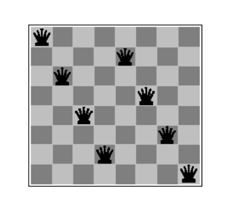
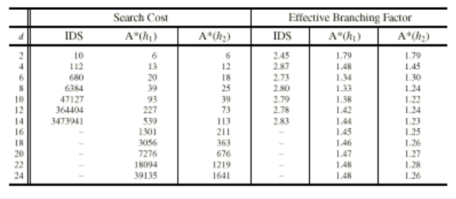

## Aula 3 - Métodos de Busca

Elementos de um Problema
* Formulação do objetivo
* Formulação do problema
  * Processo de decidir quais ações e estados devem ser considerados
* Busca
* Solução
* Execução

### Problemas e soluções bem-definidos

* Estado Inicial
* Operadores -> função sucessor S
  * conjunto de possíveis ações qdisponíveis ao sistema
* Espaço de estados
  * É o conjunto de estados alcançáveis a partir do estado inicial por uma série de ações
  * Um caminho no espaço de estados é uma sequência de ações de um estado a outro
* Teste do objetivo
  * é aplicado pelo sistema para determinar se a descrição do estado é um estado objetivo
* Custo do caminho **g**
  * é uma função que assinala um custo a um caminho

**Tipo de dados: PROBLEMA**

Componentes
* Estado Inicial
* Operadores
* Teste do Objetivo
* Função Custo do Caminho

### Medindo o desempenho da solução do problema

* A busca consegue encontrar uma solução para o problema?
* A solução encontrada é boa?
* Qual é o custo da busca em termos de tempo e memória necessários para encontrar a solução?
* Compromisso: solução ótima em tempo elevado ou vice-versa?

**Exemplo Romênia**: Em férias na Romênia, atualmente em Arad, o Voo de volta parte amanhã de Bucareste.

Formular Objetivo: Estar em Buhcarest

Formular o problema:
* Estados: Várias cidades
* Ações: dirigir entre as cidades
  
Encontrar a solução:
* Sequência de cidades

### Problemas exemplo

Problemas de brinquedo ("toy problems"), por terem uma descrição exata e concisa permitem comparar o desempenho de diferentes algoritmos.

Problemas reais ("real world problems"), suas soluções possuem utilidade real, mas a formulação pode privilegiar alguma(s) das propriedades.

#### Problema de Brinquedo

Quebra-cabeças
* Estados: Localização de cada peça, inclusive o branco
* Operadores: Branco mode à direita, esquerda, cima, baixo
* Teste do objetivo: estado corresponde à configuração desejada
* Custo do caminho: cada passo tem custo 1

Posicionamento de Rainhas-1
* Estados: Qualquer arrando de 0 a 8 rainhas no tabuleiro
* Operadores: adicionar uma rainha a qualquer posição
* Teste do objetivo: 8 rainhas colocadas, nenhuma atacada
* Custo do caminho: zero

Posicionamento de Rainhas-2
* Estados: arranjo de 0 a 8 rainhas com nenhuma rainha atacada
* Operadores: colocar uma rainha na coluna mais à esquerda vazia, tal que não seja atacada
* Teste do objetivo: 8 rainhas colocadas, nenhuma atacada
* Custo do caminho: zero

Posicionamento de Rainhas-3
* Estados: Arranjo de 8 rainhas uma em cada coluna
* Operadores: mover qualquer rainha atacada para outra posição na mesma coluna
* Teste do objetivo: 8 rainhas colocadas, nenhuma atacada
* Custo do caminho: zero

Cripto-aritmética
* Estados: um jogo com algumas letras substituídas por dígitos
* Operadores: substituir todas as ocorrências de uma letra por um dígito novo
* Teste do Objetivo: jogo contém somente dígitos e a soma é correta
* Custo do caminho: zero, todas as soluções tem a mesma validade

Mundo do vácuo
* Estado: Um dos oito estados mostrados
* Operadores: Mover à direita, à esquerda, sugar
* Teste do objetivo: não haver sujeira 
* Custo do caminho: cada ação custa 1

Mundo do vácuo com murphy
* Estados: Subconjuntos dos estados 1-8
* Operadores: Mover à direita, à esquerda, sugar
* Teste do objetivo: todos os estados no conkunto não tem sujeira
* Custo do caminho: cada ação custa 1

Missionários e canibais
* Estados: sequências ordenada de 3 números, indicando número de missionários, canibais e barcos na margem direita
* Operadores: levar um missionário ou um canibal, dois missionários ou canibais ou um de cada
* Teste do objetivo: Estado (0,0,0)
* Custo do caminho: número de cruzamentos

#### Problemas Reais

* Planejamento de rotas aéreas
* Problema do caixeiro viajante
* Leiaute VLSI
* Navegação de robôs
* Sequencia de montagem

### Gerando Sequências de ações

Na busca da solução deve-se buscar estados, para isso aplicam-se os operadores ao estado atual, gerando novos estados. Isto é chamado de expansão dos estados. A escolha do próximo estado a ser expandido é feito pela estratégia de busca. No processo de busca constrói-se uma árvore de busca.

#### Estruturas de dados para árvores de busca

Pode-se considerar que um n´o é uma estrutura de dados com 5 componentes:
* O estado representado (no espaço de estado)
* O nó pai (que gerou o nó em questão)
* o operador aplicado na geração do nó
* a profundiade do nó
* o custo do caminho a partir do estado inicial

**Tipo de dados:** nó

Componentes:
* Estado
* Nó pai
* Operador
* Profundidade
* Função de custo

Assume-se que a coleção de nós seja implementada como uma fila:
* Criar fila: cria uma fila com os elementos dados
* Vazia: retorna verdadeiro somente se não há elementos na fila
* Remove: remove o elemento na frente da fila e retorna a mesma
* Enfileirar: insere um conjunto de elementos na fila

### Estratégias de Busca

* Busca não-informada (Busca cega): Não tem informações sobre o número de passos ou custo do caminho do estado atual ao objetivo
* Busca informada (Busca heurística): Dispõe de informações que auxiliam a determinar o provável melhor caminho entre o estado atual e o estado objetivo

Características
* Completude: a estratégia encontrará a solução se ela existir?
* Otimalidade: a estatégia encontra a melhor solução quando existem várias?
* Complexidade temporal: quanto demora para encontrar a solução?
* Complexidade de espaço: quanta memória é necessária para a busca?

#### Busca em largura

Todos os nós da profundidade $d$ da árvore de busca sao expandidos antes dos nós em profundidade $d+1$

#### Busca de custo uniforme

Modificaa busca primeiro em largura expandido o nó de menor custo na fronteira (mesmo que já tenha atingido o estado objetivo). Encontra a melhor solução se o custo do caminho nunca decrescer ao longo do caminho

$$g(SUCESSOR(n)) \geq g(n)$$

#### Busca em profundidade

Expande sempre o nó no nível mais profundo da árvore de busca. Somente quando atinge um nó não-objetivo sem expansão ocorre o retorno para um nível superior.

#### Busca com profundidade limitada

Coloca um limite na máxima profundidade de um caminho. O limite pode ser implementado em um algoritmo especial de busca com profundidade limitada ou usando o algoritmo de busca geral com opeadores que mantenham um registro da profundidade.

---

Busca com aprofundamento iterativo: Busca com profundidade limitada, porém o limite de profundidade é incrementado caso não seja atingido o objetivo.

Busca bi-direcional

Comparação das estratégias

Evitando repetições de estados
* Não retornar ao estado anterior
* Não criar caminhos que contenham ciclos
* Não gerar qualquer estado que já tenha sido gerado anteriormente

### Busca Heurística

Implementação do método de busca do melhor primeiro.

Utiliza uma medida estimada do custo da solução e tenta sua minimização. A medida deve incorporar uma estimativa do custo do caminho de um estado ao estado objetivo mais próximio. Existe duas aboragems para este algoritmo:
* Expandir o nó mais próximo a um objetivo
* Expandir o nó no caminho da soluçãp de menor custo

A mais simples estratégia de busca do melhor primeiro consistem em minimizar o custo estimado para atingir o objetivo

$h(n)=$ custo estimado do caminho mais "barato" do estado *n* até o estado objetivo.

Mapa da Romênia

Busca gulosa para Bucareste

Busca gulosa para Bucareste 2

* Busca Gulosa não é ótima nem completa
* Busca de custo uniforme (que usa $g(n)$) é ótima e completa mas é ineficiente
* Pode-se combinar as duas usando-se $f(n)$ como custo estimado total da solução de menor custo passando por *n* 

$$\displaystyle f(n)=g(n)+h(n)$$

**Estratégia A\***
Uma heirística é admissível se ela nunca superestima o custo de atingir o objetivo, ou seja, ela é otimista.  
Esta estratégia **A\*** faz uma busca do melhor primeiro usanod *f* como função de avaliação e uma função *h* admissível

**Funções Heurísticas**

* $h_1$: quantidade de blocos na posição incorreta
* $h_2$: soma das distâncias de cada bloco à sua posição objetivo

**Comparação entre A\* com** $h_1$ **e** $h_2$ **com aprofundamento iterativo**

**Mapa da romênia com contornos com $f=380 \ , f=400$**

**Aprofundamento Iterativo A\***

Com a finalidade de conservar memória pode-se usar a ideia do algoritmo de aprofundamento iterativo.

Transforma-se a estratégia de busca A* em aprofundametno iterativo usando-se a noção de contorno de mesmo custo.

Boa estratégia em domínios pequenos mas possui dificuldades em domínios grandes.

